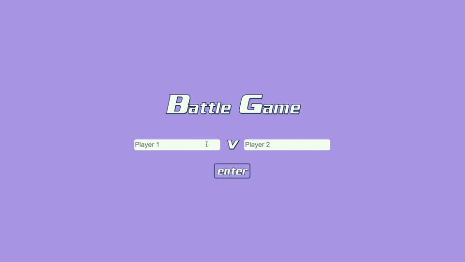
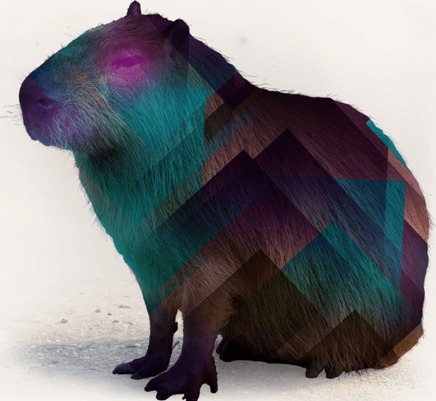

<div align="center">

#### *battle_app*


[](https://https://ruby-lang.org/)



<h3>STACK</h3>

|                                                        | Tool                                                 | Use?                                       | Where can I see it?                                                  |
|--------------------------------------------------------|------------------------------------------------------|--------------------------------------------|----------------------------------------------------------------------|
|        | [RSpec](https://rspec.info/)                         | Testing tool for Ruby.                     | In user_spec.rb - tests pure Ruby code.                              |
|     | [Capybara](https://github.com/teamcapybara/capybara) | Acceptance test framework for Ruby.        |  In spec/features - testing for expected features.                   |
|         | [Ruby](https://www.ruby-lang.org/en/)                | Programming language.                      | Everywhere!                                                          |
|       | [jQuery](https://jquery.com/)                        | Small, feature rich Javascript library.    | In subtle animations on the attack buttons.               |
|  | [Animate.css](https://animate.style/)                | CSS library for animations.                | The fade in message once the game is over. |
|      | [Sinatra](http://sinatrarb.com/)                     | DSL for quickly making web apps with Ruby. | In the file structure for the project - it is built on Sinatra.      |

</div>

## Install

To install:
``` bash
% git clone https://github.com/arthurfincham/battle
```